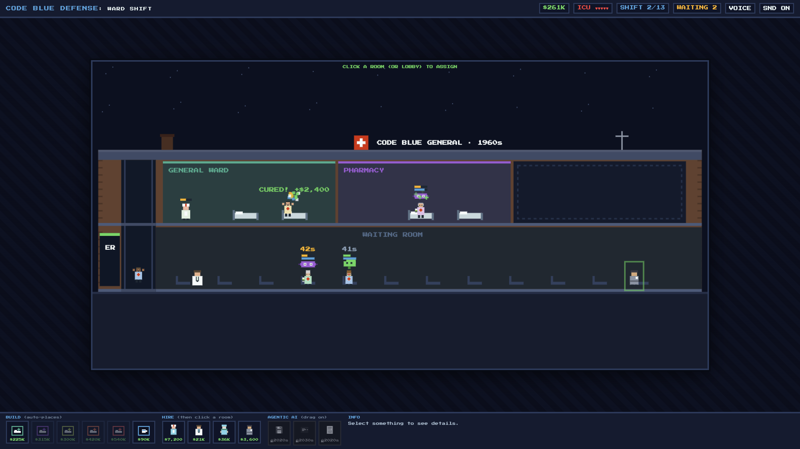

# Code Blue Defense: Ward Shift

### ▶ [PLAY IT NOW](https://kienmd.github.io/code-blue-defense/) — no install, right in your browser

An 8-bit hospital-management game where **the pathogens are the enemies and
every patient walks out smiling** (you hope). Build the ward Fallout
Shelter-style, post a nurse to triage, diagnose the ailment, allocate the
bed — and cure everyone before the disease wins. Thirteen shifts march the
hospital from the **1950s to the year 3000**: every decade upgrades the
standard of care, re-skins the building, and eventually hands you **agentic
AI upgrades** that multiply your human staff. A guided tutorial walks you
through your first shift.



Zero dependencies, zero build step: vanilla HTML5 Canvas + JavaScript.

## Run it locally

```bash
git clone https://github.com/kienmd/code-blue-defense.git
cd code-blue-defense

# option 1: just open it
open index.html

# option 2: any static server
python3 -m http.server 8080   # then visit http://localhost:8080
```

## How to play

- **Build rooms** from the shop — they auto-place Fallout Shelter-style
  (floor 1 fills left-to-right, then the hospital grows a floor). Repeat
  copies of the same room type cost x1.5 each, so diversify.
- **Hire staff**, then click a room (or the lobby) to post them.
  **Not everyone can diagnose**: doctors make a formal lobby DIAGNOSIS
  fast, nurses do a slower preliminary ASSESSMENT, and everyone else
  (surgeon, orderly) is refused lobby triage outright.
- **Patients** arrive with a presenting complaint (hover them to hear it).
  Once diagnosed, **click the patient, then a room** to allocate their bed.
  The right room treats at full rate; wrong rooms limp along.
- **Deterioration** is the clock: a patient's health hits 0 → ICU transfer
  (a life lost). ICU capacity is 5 for the whole run.
- **Shifts are rounds.** Each ends with a SHIFT REPORT (including a full
  income/expense ledger), then a player-paced COOL-OFF for building. When
  the next shift crosses a decade, a mandatory ERA REPORT teaches what the
  age invented and exactly how it changes your numbers.
- **Drag AI upgrades** (2020s+) onto their targets: the **Ambient AI
  Scribe** onto a staffer, the **Agentic Lab-Router** onto the lobby, the
  **Prior-Auth Agent** onto the door. Locked cards show their unlock era —
  click any card for the full stats codex.

## The economy (docs/ECONOMY.md)

Money enters through four faucets and leaves through recurring drains, so
every cool-off is a real resourcing decision:

- **Case reimbursements** — outcome-scaled: right-room discharge x1.0,
  wrong-room cure x0.8, undiagnosed cure x0.7 ("no chart, no charge").
- **Walk-in copays** — a small floor faucet; a shift never grosses $0.
- **Era modernization grants** — at each era-up, scaled UP the worse you're
  doing (Hill-Burton / HITECH flavor): a gentle catch-up rail.
- **Drains** — per-shift salaries and 2% room upkeep, settled at shift end.
  Shortfalls never block you: they carry as ACCOUNTS PAYABLE (soft debt).
  If you're ever stranded below one hire, a county bailout tops you up —
  the first is free, the rest cost stars.
- **Era inflation** scales all prices and payouts (x0.5 in the 1950s →
  x10 by Y3K) without changing the ratios that set difficulty.

## Roster

| Unit | Role |
|---|---|
| Nurse | Cheap generalist; slow lobby ASSESSMENT; low burnout |
| Doctor | Fast treatment + the proper 2s lobby DIAGNOSIS; burns out fast |
| Surgeon | x1.8 in Surgery, half-speed elsewhere; cannot diagnose |
| Orderly | Lobby duty: calms waiting patients (-15% decay each); cannot diagnose |
| Ambient AI Scribe (2020s) | On a staffer: -50% burnout gain, +30% speed |
| Agentic Lab-Router (2030s) | On the lobby: instant AI diagnosis + auto-assign |
| Prior-Auth Agent (2020s) | On the door: +25% payout per discharge |

**Rooms:** General Ward (flu), Pharmacy (bacteria), Virology Lab
(virus + airborne spore isolation), Surgery (trauma), Cardiology (cardiac
events), Break Room (staff stress recovery). Airborne spores are contagious
in the waiting room — isolate them fast.

## The era march (docs/ERAS.md)

Thirteen shifts, one decade-defining title card each: 1950s → 1960s →
1970s-80s → 1990s → 2000s → 2010s → 2020s → 2030s → 2040s → 2050s → 2075 →
2100 → Y3K. Each era silently upgrades the standard of care (faster
diagnosis, better treatment, less burnout), re-tints the walls and scrubs,
ages the roofline (brick chimney → water tower → HVAC → glass → helipad →
holo-spire), and — from the 2030s — makes AI diagnosis the free baseline.

## The agentic AI layer (for judges)

`js/agentic.js` is the seam between the game and a real LLM. When the
Lab-Router is installed (or the 2030s arrive), every arriving patient is
serialized into a **Patient Manifest** and passed to
`simulateAgenticDecision()`:

- With `window.ANTHROPIC_API_KEY` set (see the comment in `index.html`), it
  calls Claude with a pinned JSON output contract, and patient complaints
  are LLM-written too.
- Without a key it falls back to deterministic structured-data matching
  over the same symptom table — the demo is fully self-contained offline.

Design principle: **the LLM decides WHAT the patient has; the game decides
how much that knowledge is worth.** All balance math is centralized and
commented in `js/constants.js`.

## Repo layout

```
index.html        entry shell + optional API-key hook + script load order
style.css         retro UI shell (Press Start 2P, NES-ish palette)
js/constants.js   ALL balance numbers: eras, economy, rooms, staff, AI
js/agentic.js     LLM scaffold + local triage/complaint fallback
js/levels.js      13-shift arrival schedule
js/entities.js    Patient/Staff/Room classes + pixel sprite painters
js/audio.js       WebAudio chiptune synth + theme + SFX
js/narrator.js    speechSynthesis narrator + script table + subtitles
js/tutorial.js    first-run guided tutorial (spotlight engine + step table)
js/state.js       the mutable game state G + query helpers
js/ui.js          DOM/HUD/shop/report/era-report/inspector
js/sim.js         run lifecycle, shift engine, treatment, economy settle
js/input.js       canvas mouse/keyboard + AI drag-drop (inverse camera)
js/render.js      the whole frame: building, eras, entities, era card
js/main.js        boot + rAF loop
docs/ERAS.md      canonical decade research + per-era design
docs/ECONOMY.md   canonical economy spec (faucets/drains/lanes/rails)
docs/TECH_TREE.md era tech-shop research
DESIGN.md         design ideation history + decision log
```

## Audio & narration

The game is narrated by a distinguished British gentleman through the
browser's built-in **speechSynthesis** — the best available male en-GB
voice is picked automatically (enhanced/premium variants preferred), with
**always-on subtitles**. The chiptune theme ducks while he speaks; the
SND ON/OFF toggle mutes everything. `js/narrator.js` carries a disabled
ElevenLabs TTS seam as a possible future upgrade — nothing is wired to it.

The only optional key is Anthropic, for live-LLM triage decisions and
patient complaints (deterministic offline tables run otherwise): define
`window.ANTHROPIC_API_KEY` before the game scripts load (see the comment
block in `index.html`). Never commit keys.
